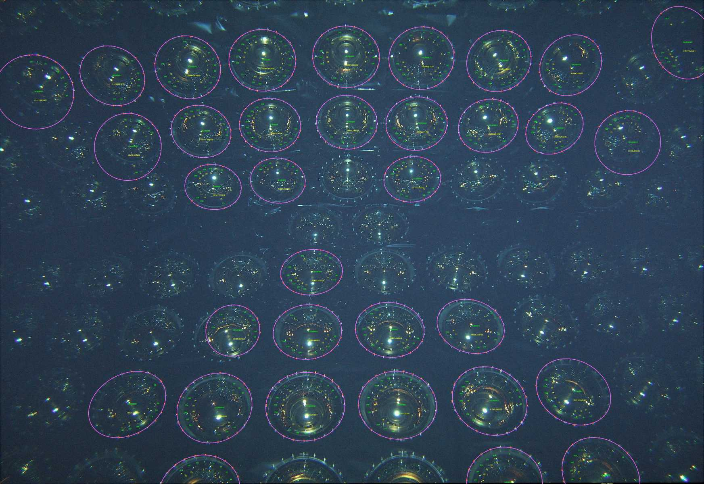

# FeatureReco

Code to do feature recognition to locate bolts and PMT centers.  Implemented using OpenCV libraries.  Output is to ROOT trees.

You will need a copy of opencv libraries installed, as well as the ROOT libraires (root 6).  To build the code:

```
> cd FeatureReco
> cmake .
> make
```

# Undistortion program

Simple program to take input JPG, apply undistortion, and write out undistoted image.

```
./UndistortImage /bigdisk/jamieson/TOW-Feb2020/BarrelSurveyFar/B0170163.JPG [output-file]
```

If output file is not specified, then it names output file undistorted<input-file-name>

# Feature finding code

Locate bolts in image by applying filters and hough transform.

```
./FindBoltLocations [input-image-file-name-with-path] [opt=bolt-location-textfile-with-path]
```

# Config.txt
Configuration file to change parameters and set verbosity flag.

<pre>
Output file names are: 
*  gausblur[input-file-name]  -- image with gaussian applied (if enabled) 
*  bifilter[input-file-name]  -- image after bilateral filter applied (if enabled)
*  sobel[input-file-name]     -- image after sobel filter applied (this is input to Hough)
*  blob_candidate             -- b&w image with bolts found using blob detection represented as white and rest black.
*  hough_candidate 	      -- b&w image with bolts found using hough transform represented as white and rest black.
*  circles[input-file-name]   -- original image with circles found by hough added
*  final.jpg 		      -- final image.
*  FindBoltLocation.root      -- root histograms
*  bolts[input-file-name].txt -- text file containing [pmtid(-1 for now) pmtx pmty pmtr boltid boltx bolty] 
*  Config_files		      -- Directory contaning config files for different images.
*houghellipse[file_number]    -- final ellipse found after pruning.
*houghellipse_before[file_number]      -- ellipses found before pruning.
</pre>

<table style ="width:100%;">
<tr>
<td>
 
</td>
<td>
 
</td>
</tr>
<tr>
<td>
  Side Image(houghellipse239.jpg)
</td>
<td>
  Corner Image(houghellipse379.jpg)
</td>
</tr>
</table>


# First pass processing

Run FindBoltLocations on each image using the config file Config_fastscaledetect_barrelfar.txt which will determine the range of ellipse parameter bb is best.  The output from this can be uesd to build the circleranges.txt file needed to process all of the images.

# Processing scripts

On cedar for example, copy the correct Config.txt to the directory to start the processing from, and copy the scripts:
- process_image_XXX.sh
- prepare_submission.sh
- submit_jobs.sh
Prepare a file called circleranges.txt that contains (image-number ellipse-bmin ellipse-bmax) for each image. Also prepare a file runlist.txt that has the list of image numbers to process.

Edit process_image_XXX.sh to go to the correct output directory, and edit the run line to use your copy of the executable, and point to the correct directory of images that you are processing.  Potentially edit the execution time, memory and number of threads.  The number of threads should match the number of phibins used in the houghellipse finder (in Config.txt).

You can now run ./prepare_submission.sh that will build a separate process_image_XXX.sh for each image.

Its best to try submitting only one job first to make sure it runs okay.  Once you verify it runs okay, you can run ./submit_jobs.sh to submit one job for each image.


# Post processing 

## summarise_pmts_found

This just analyses the textfile output from running FindBoltLocations on a collection of images.  The images to include in the summary are listed in the file files_to_summarize.txt.  To build the executable, a separate makefile is used:
```
make -f makefile_summarize_pmts
```
The output of running this executable is a rootfile with histograms (summarize_pmts_found.root).


## merge_ttrees.C

Root macro to take the individually processed output from FindBoltLocations.root files of each image, and put them into one root TTree.  You will need a symlink to the files:
```
FeatureTTree.hpp
libFeatureTreeLib.rootmap
libFeatureTreeLib.so
```
in the directory before you run the macro.  Also, you will need the list of root files to put into one output file in the file "trees_to_merge.txt".  Then to run the macro:
```
> root
root> .x merge_ttrees.C+
```
The output will be in the file merge_ttrees.root. 

## analyse_merge_ttree

This program runs on the merge_ttrees.root file and calculates the camera location in the xy-plane for each image using the PMT ellipse size as it changes across the image.  The program reads in the file of image metadata ImageMetaData.tsv to get the camera facing to help determine the camera location.  Details of the method are at https://www.overleaf.com/read/mnbzjbpzmygf.


To do list:
* Improve parameters for top of tank images.
* Work on feature labelling! (get analyse_merge_ttree working).
*


